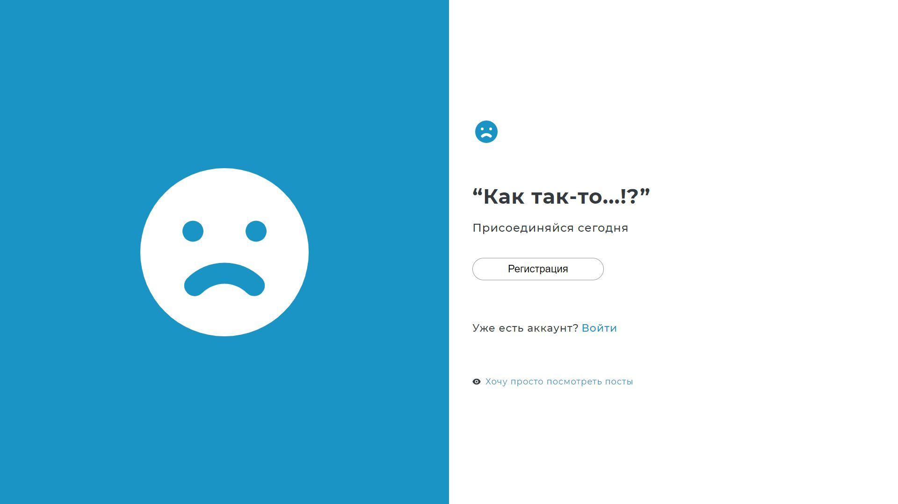
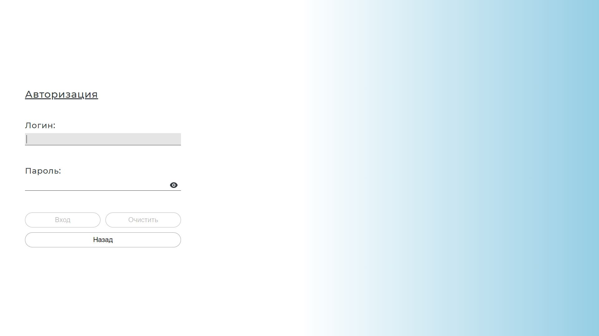
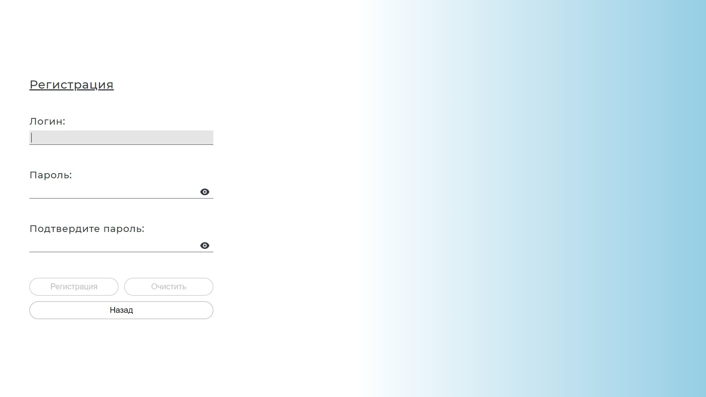
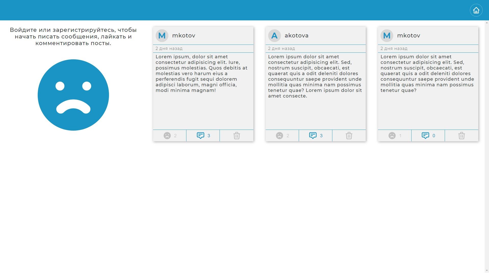
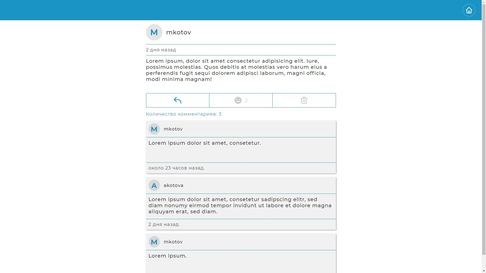
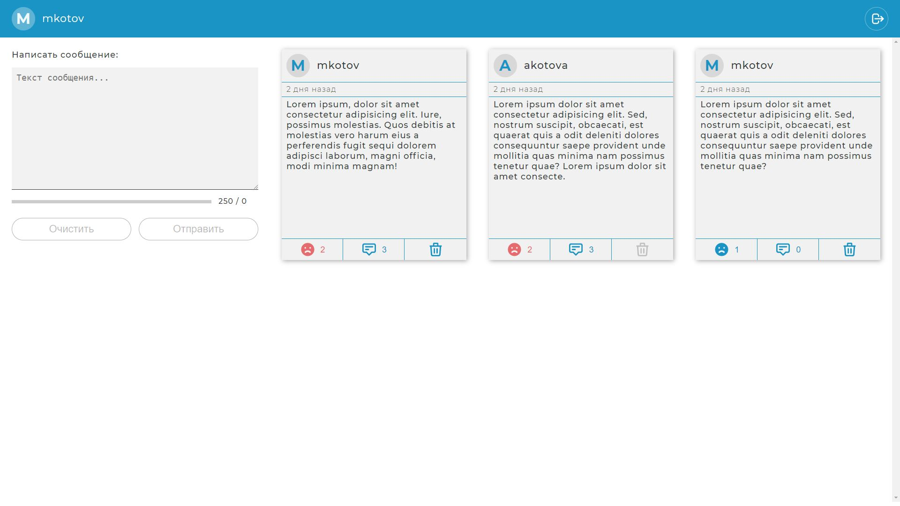
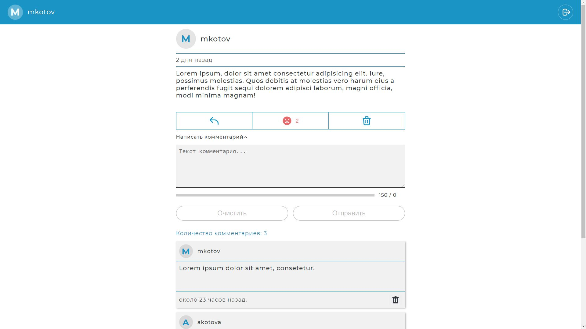

# Как так-то...?

### Что-то бесит или случилось? Поделись этим с другими, может кто-то попал в такую же ситуацию.

**Start page**

**Login**

**Registration**

**Posts**

**Post**

**Posts - user logged in**

**Post - user logged in**

**Demo**

To install und run the project:

### `1. npm install`

### `2. npm run dev`

(Please check the back-end part: [https://github.com/VolodymyrVoronov/kak-tak-to-back](https://github.com/VolodymyrVoronov/kak-tak-to-back))

_DISCLAIMER:_
Please note, this project is for demonstration purpose only.
